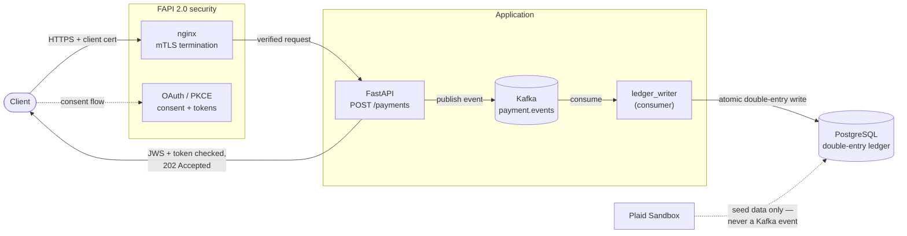
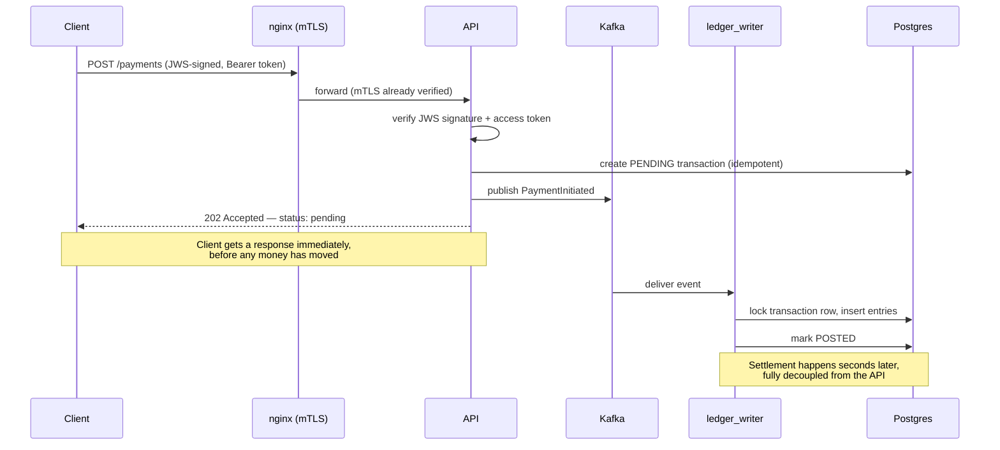

# CoreLedger

**An event-driven payments settlement engine, secured to the FAPI 2.0 profile — the real standard banks and fintechs are held to for third-party payment initiation.**

A client submits a payment; the API authenticates and authorizes the request, then publishes an event to Kafka instead of writing the ledger directly. A separate consumer picks up that event and performs the actual double-entry Postgres write, asynchronously. The API stays fast under load; the ledger stays correct under concurrency, retries, and failure.

Built as a hands-on demonstration of the specific hard problems payment platforms have to solve — not a toy that ignores them.

## What this solves

| Problem | How it's solved |
|---|---|
| A burst of concurrent requests shouldn't slow down or block the API | API publishes to Kafka and returns `202 Accepted` immediately; settlement happens asynchronously in a separate worker |
| A network retry or Kafka's own at-least-once redelivery must never double-post a payment | Two independent idempotency layers — `ON CONFLICT DO NOTHING` on the client's idempotency key, and a `SELECT ... FOR UPDATE` + status check on the consumer side |
| Money can never partially move — debit posted without its matching credit | Both ledger entries insert in one atomic DB transaction, with a checked balance invariant before commit |
| An unauthorized or tampered request must never be able to move money | Full FAPI 2.0 profile: mTLS client auth, JWS request signing, PKCE consent, replay protection — see below |
| A multi-service system needs to actually run reproducibly | `docker compose up -d --build` brings up all five services with health-check-gated startup order |

## Architecture



## How a payment actually flows

The interesting part isn't the happy path — it's that the client gets a response *before* the money has moved, and the system stays correct even when things fail or repeat.



## Security: the FAPI 2.0 profile

`POST /payments` is protected by four independent, stacked checks — each catching a different class of attack:

- **mTLS** (`nginx` + `api/auth.py::require_mtls_client`) — proves *which client* is calling, verified at the TLS layer by a real client certificate, not just a bearer credential.
- **JWS request signing** (`client_sdk.py`, `api/jws_auth.py::require_valid_jws`) — a detached JWS over the exact request body, so a modified amount or account in transit fails signature verification. Uses `joserfc` (the actively maintained successor to `authlib.jose`).
- **PKCE consent** (`oauth/` package) — an OAuth 2.0 authorization-code flow with mandatory PKCE, proving a real consent step happened before any client can act. Built as a hand-rolled FastAPI adapter around Authlib's framework-agnostic core, since Authlib only ships official Flask/Django integrations.
- **Replay protection** (`used_jtis` table) — every signed request carries a unique `jti`; a captured, valid request resubmitted verbatim is rejected.

All four have been verified live and adversarially — not just unit-tested — including a real tampered-payload rejection and a real replayed-request rejection through the actual running nginx + API stack.

## Security highlights

Four independent, stacked controls protect `POST /payments` — each catching a genuinely different attack class, not one big auth check:

| Security property | Mechanism | Standard / concept |
|---|---|---|
| **Authentication** — proving who's calling | mTLS: client presents a cert verified by nginx against a private CA | TLS client certificate authentication |
| **Integrity** — the payload wasn't modified in transit | Detached JWS signature over the exact request body | Message-level signing, independent of transport (RFC 7515) |
| **Authorization / consent** — the account owner actually approved this | OAuth 2.0 Authorization Code + PKCE | RFC 6749 + RFC 7636 — the same flow real Open Banking APIs use |
| **Anti-replay** — a captured, valid request can't be resubmitted | Every signed request's `jti` tracked in `used_jtis`; `iat` freshness window bounds how long that table needs to remember anything | Nonce / replay-cache pattern |
| **Secrets hygiene** | `.env` gitignored; `.env.example` kept placeholder-only; full commit history audited before every push | Basic, frequently-skipped practice |

Each control was verified adversarially, not just implemented — the test suite and live demos include a request with a modified amount rejected on signature mismatch, a captured request resubmitted verbatim rejected as a replay, and a request sent directly to the API (bypassing nginx, and therefore mTLS) rejected for missing verification. Along the way, real credentials briefly landed in the wrong file (`.env.example`, the public template, instead of the gitignored `.env`) — caught by auditing the *entire* git history before ever pushing, not just the working diff, confirming nothing had been committed before it was fixed.

## Tech stack

Python 3.13 · FastAPI · PostgreSQL + SQLAlchemy + Alembic · Apache Kafka (KRaft mode) · Docker Compose · nginx · Authlib · `joserfc` · `confluent-kafka` · Plaid API · pytest · `uv`

## Project structure

```
src/coreledger/
├── api/              # FastAPI app: /payments route, mTLS + JWS dependencies
├── oauth/            # PKCE authorization server (FastAPI adapter over Authlib's core)
├── db/                # SQLAlchemy models, Alembic-backed schema, the idempotent ledger writer
├── ledger_writer/      # The Kafka consumer that performs actual settlement
├── client_sdk.py        # What a real integrating client uses to sign requests / drive PKCE
└── events.py              # Shared Kafka event schema (producer + consumer contract)

nginx/                  # mTLS termination config + dev CA
scripts/                  # Cert generation, client registration, Plaid ingestion, manual demos
tests/                      # 22 tests: idempotency under concurrency, full API + OAuth flows
alembic/                     # Schema migrations
docker-compose.yml             # Full stack: postgres, kafka, nginx, api, ledger_writer
Dockerfile                       # uv-based image shared by api and ledger_writer
```

## Running it

There are two modes, and they should not run against the same Kafka topic at the same time — see **Why not both at once** below.

### Dev / test loop

Bring up just the stateful services, run the app processes on the host:

```
docker compose up -d postgres kafka
uv run alembic upgrade head
uv run pytest
```

`api` and `ledger_writer` can also be run directly for manual testing:

```
uv run uvicorn coreledger.api.main:app --port 8000
uv run python -m coreledger.ledger_writer.consumer
```

### Full stack (mTLS + nginx)

```
docker compose up -d --build
```

This also builds and runs `api` and `ledger_writer` as containers, and brings up `nginx` terminating mTLS on `https://localhost:8443`. First time only: generate dev certs and register the demo client's JWS signing key —

```
./scripts/generate_certs.sh
uv run python scripts/register_test_client.py
```

### Why not both at once

`pytest`'s `clean_tables` fixture truncates the ledger tables before every test, but Kafka's topic is durable and outlives that truncation. If the containerized `ledger_writer` is running at the same time as the test suite, it will eventually try to settle a transaction whose row was just truncated out from under it — a genuine data-integrity violation, so it fails loudly and exits (see `db/ledger.py::settle_transaction`) rather than silently skip it. This is correct behavior for the consumer, but means the two modes shouldn't share a live topic: `docker compose stop ledger_writer` (or `docker compose down`) before running the test suite, and recreate the `payment.events` topic if you hit this:

```
docker compose exec kafka /opt/kafka/bin/kafka-topics.sh --delete --topic payment.events --bootstrap-server localhost:9092
docker compose exec kafka /opt/kafka/bin/kafka-topics.sh --create --topic payment.events --bootstrap-server localhost:9092 --partitions 6 --replication-factor 1
```

The same truncation also deletes any accounts seeded by `scripts/ingest_plaid_seed_data.py` (and, via cascade, their `plaid_transactions`) — test isolation intentionally wins that trade-off rather than the fixture tip-toeing around demo data. Re-run the ingestion script after running the test suite if you want seeded accounts back for a demo; it's idempotent (reuses the cached `dev_keys/plaid_access_token.json` rather than re-linking), so re-running just restores the same seeded state.

## Testing

```
uv run pytest
```

22 tests across three areas:
- **`test_idempotency.py`** — concurrent duplicate-write safety, including 10 simultaneous identical requests asserted down to exactly one posted transaction
- **`test_api.py`** — the full payment path (mTLS, JWS signature verification, tampered-payload rejection, replay rejection, access-token enforcement) and the Kafka → settlement handoff
- **`test_oauth.py`** — the PKCE flow itself: successful issuance, wrong `code_verifier` rejection, single-use authorization codes, denied consent

## Seeding realistic account data from Plaid Sandbox

```
cp .env.example .env   # fill in PLAID_CLIENT_ID / PLAID_SECRET from https://dashboard.plaid.com
uv run python scripts/ingest_plaid_seed_data.py
```

Links a Plaid Sandbox "custom user" (`override_username=user_custom`) with two hand-authored accounts — **CoreLedger Checking** and **CoreLedger Savings** — and about 90 days of realistic transaction history: biweekly payroll, monthly rent, subscriptions, weekly groceries, and savings transfers. Seeded into `accounts`/`plaid_transactions`, read-only reference tables the settlement pipeline never touches (see the module docstring for why — Plaid is a data source here, never a second event source). If it prints `seeded 0 transactions` on the very first run, that's normal — Sandbox takes a few seconds to generate transaction history after linking; just run it again.

## Notable design decisions

- **Integer minor units, never floats**, for every money amount — the standard defense against floating-point rounding errors in financial data.
- **Kafka partitioned by `from_account_id`**, not a random key — this is what gives ordering guarantees exactly where the API needs them (all events debiting one account land on the same partition), at the cost of v1 only supporting single-account postings, not arbitrary two-account transfers.
- **A single consumer instance**, not a scaled consumer group — deliberately simpler correctness story for this scope; documented as the boundary to revisit if this became a real multi-instance service.
- **KRaft-mode Kafka**, no Zookeeper — the direction Kafka itself is standardizing on.
- **The balance invariant is application-level, not a DB constraint** — checked inside the same transaction as the insert, which is simpler to reason about under concurrency than a cross-row DB trigger.

## Known limitations

Not connected to a real bank — Plaid Sandbox provides realistic but fake data. No real money moves. v1 supports single-account postings only, not cross-account transfers. The PKCE consent flow uses a fixed demo user rather than real login. Hasn't been load-tested at real production scale — the correctness guarantees are proven, not the throughput ceiling.
